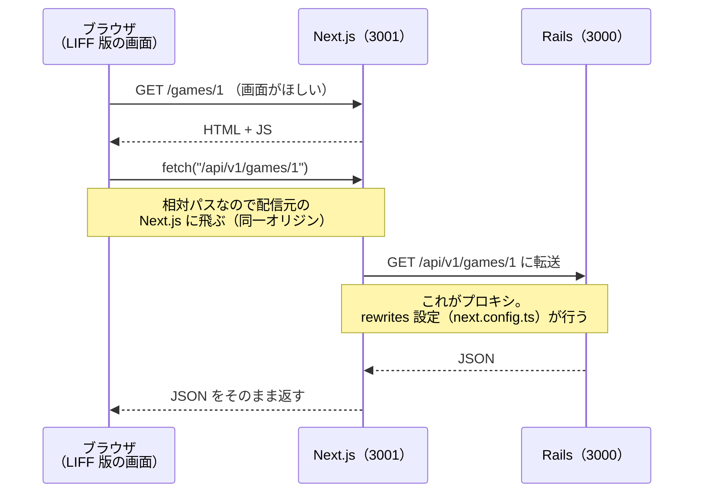
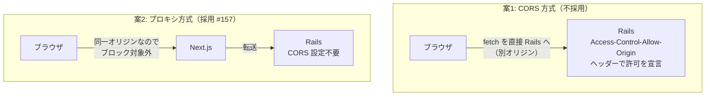

# フロントエンドと Rails の通信経路（API プロキシと CORS）

LIFF 版（Next.js）が Rails の JSON API をどう呼んでいるか、なぜ「プロキシ」を挟んでいるかを、
初見の人でも分かるように図解するドキュメント。全体像は `docs/architecture.md` を参照。

## 結論（この構成の意図）

- ブラウザは **Next.js とだけ**通信し、Rails とは直接通信しない
- `/api/*` へのリクエストは Next.js サーバーが受け取り、裏で Rails に転送（プロキシ）する
- こうすることでブラウザから見た通信相手が1つ（同一オリジン）になり、**Rails 側の CORS 設定が不要**になる（[#157](https://github.com/tsukamotohiroaki/mahjong_score/issues/157) で決定）

## 登場人物

| サーバー | ポート | 役割 |
|---|---|---|
| Next.js | 3001 | LIFF 版の画面（HTML/JS）を配信する |
| Rails | 3000 | JSON API（`/api/v1/...`）を提供する |

## リクエストの流れ

`frontend/app/lib/api.ts` は `fetch("/api/v1/games")` のように**相対パス**で API を呼ぶ。
相対パスなのでリクエストは画面の配信元（Next.js）に飛び、`frontend/next.config.ts` の
`rewrites` 設定によって Rails に転送される。

ブラウザから見える通信相手は終始 Next.js だけ。Rails の存在はブラウザからは見えない。

## なぜプロキシを挟むのか — オリジンと CORS

### オリジンとは

**スキーム + ホスト名 + ポートの3点セット**。3つすべて一致して初めて「同一オリジン」。

| URL | スキーム | ホスト | ポート | 判定 |
|---|---|---|---|---|
| `http://localhost:3001`（画面の配信元） | http | localhost | 3001 | 基準 |
| `http://localhost:3000`（Rails） | http | localhost | **3000** | **別オリジン**（ポート違い） |

### 同一オリジンポリシー（ブラウザの防御ルール）

ブラウザは「ページ上の JS は、配信元と同じオリジンのレスポンスしか読めない」というルールを
全サイト一律で適用する。これがないと、悪意あるサイトのページが、ユーザーがログイン中の
別サイトの API を勝手に fetch して情報を盗めてしまうため。

LIFF 版も「3001 のページから 3000 へ fetch」という形の上では同じパターンなので、
直接 Rails を呼ぶとこのルールでブロックされる。

### 取れた選択肢は2つ

- **CORS**（Cross-Origin Resource Sharing）: 別オリジンへのアクセスを「サーバー側が明示的に
  許可すれば」解除できる仕組み。Rails がレスポンスヘッダーで許可オリジンを宣言する。
  rack-cors gem 等の追加と、環境ごとの許可リストの保守が必要になる
- **プロキシ方式**: ブラウザの通信相手を Next.js に一本化し、別オリジン通信そのものを消す。
  Rails 側の設定・保守が一切不要なため、こちらを採用した

## 転送先は環境によって変わる

転送は Next.js サーバーの**内部**（サーバーサイド）で行われるため、転送先は
「Next.js サーバーから見た Rails の場所」を環境変数 `API_BASE_URL` で指定する。

| 環境 | Next.js の動き方 | `API_BASE_URL` | 理由 |
|---|---|---|---|
| 開発（現状） | ホスト上で `next dev` | 未設定（デフォルト `http://localhost:3000`） | 同じマシンに Rails が直接いる |
| 本番（#203 以降） | Docker コンテナで `next start` | `http://web:3000` | コンテナ内の `localhost` は自分自身を指すため、compose のサービス名で Rails コンテナを指定する |

## 関連ファイル・イシュー

- `frontend/next.config.ts` — `rewrites` によるプロキシ設定の実体
- `frontend/app/lib/api.ts` — 相対パスで API を呼ぶ通信層
- [#157](https://github.com/tsukamotohiroaki/mahjong_score/issues/157) — プロキシ方式の決定経緯
- [#203](https://github.com/tsukamotohiroaki/mahjong_score/issues/203) — 本番環境（Docker）への組み込み
