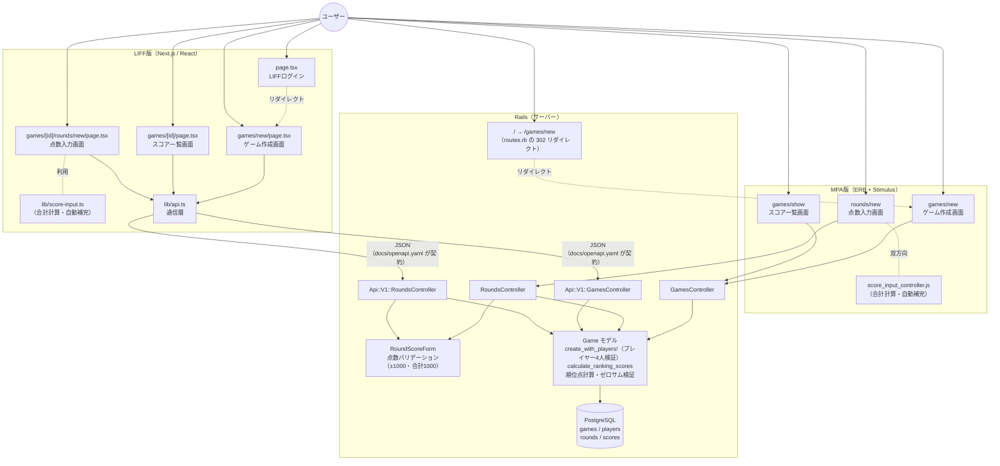
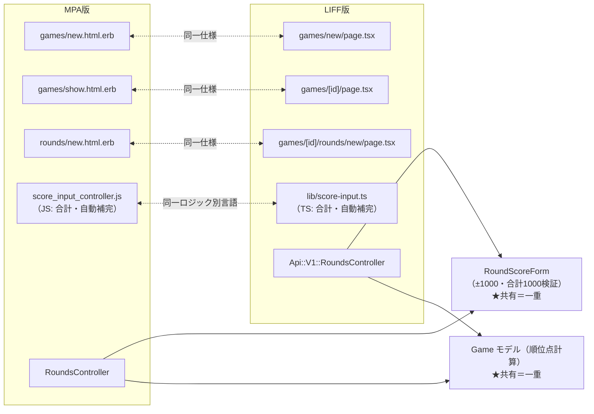

# アーキテクチャ構成図

本プロジェクトの全体像（MPA 版 + JSON API + LIFF 版の併存構成）を1枚で掴むためのドキュメント。
構成に影響する実装変更（画面・コントローラー・API の追加や削除）をしたときは、この図も更新する。

## クライアント構成の方針

- **MPA 版（ブラウザ）と LIFF 版（LINE）は、どちらも正式なクライアント**とする（マルチクライアント構成）
- MPA 版は LIFF 版へ移行するための足場ではない。撤去予定はない
- 両版の橋渡しは、JSON API（`/api/v1`）と OpenAPI 仕様書（`docs/openapi.yaml`）を契約として行う
- SPA・ネイティブアプリは当面スコープ外（CLAUDE.md の方針）

### この方針に至った経緯

当初は MPA で MVP を最短リリースし、LIFF 版へ段階的に移行して MPA を引退させる方針だった（ストラングラーフィグパターン）。2026-08-22 に、最終段階の MPA 撤去は実行しないことを決定した。

主な理由は、LIFF 版が `liff.login()` を必要とするため、MPA を撤去すると LINE がアプリ全体の単一障害点になること。詳細な理由・検討した選択肢・引き受けるコストは [ADR-0001: MPA 版を残す](adr/0001-mpa-%E7%89%88%E3%82%92%E6%AE%8B%E3%81%99.md) を参照。

## 全体構成図

## 二重実装マップ

MPA 版と LIFF 版で「同一仕様の別実装」になっているペアの一覧。
仕様変更時は必ずペアの両方を修正する。

- 点線ペア（m1〜m4）が「変更時に2箇所直す場所」。**実線の先（RoundScoreForm / Game モデル）は共有されており、二重実装ではない**
- コントローラーの点数検証は `RoundScoreForm` に一本化済み（[#193](https://github.com/tsukamotohiroaki/mahjong_score/issues/193)）。MPA・LIFF 両経路がこれを呼ぶため、二重実装ペアには含まれない
- ゲーム作成の「プレイヤーちょうど4人」検証は `Game.create_with_players!` に集約済み（[#192](https://github.com/tsukamotohiroaki/mahjong_score/issues/192)）。同上

## 読みどころ

1. **すべての矢印が最終的に Game モデルに集まる** — 順位点計算・ゼロサム検証は Game モデル1箇所に集約されており、MPA・LIFF どちらの経路でも同じ計算結果になる。ここが壊れると全経路が同時に壊れるため、`spec/models/game_spec.rb` が最重要テスト
2. **画面まわりは二重、計算とデータは一重** — 二重実装マップの点線ペアが「変更時に2箇所直す場所」の一覧。MPA 版を維持する方針（[ADR-0001](adr/0001-mpa-%E7%89%88%E3%82%92%E6%AE%8B%E3%81%99.md)）のため、これは一時的な負債ではなく恒久的な管理対象になる。現状は Playwright が MPA 版、Vitest が LIFF 版と検証が分かれており、「2つが同一の挙動か」を検証する手段がない（[#175](https://github.com/tsukamotohiroaki/mahjong_score/issues/175) で対応）
3. **仕様書にあるが誰も呼んでいない API がある** — `docs/openapi.yaml` に定義された `GET /api/v1/games`（ゲーム一覧）は Rails 側に実装があるものの、`lib/api.ts` に対応する関数がなく、MPA・LIFF いずれの画面からも呼ばれていない。画面操作では到達しないため、ブラウザでの動作確認では検証できない
4. **`lib/api.ts` と API コントローラーの間が契約境界** — レスポンス構造を変えると LIFF 版だけが静かに壊れる。`docs/openapi.yaml` と `spec/requests/api/v1/` を同期させて守る。この区間の通信経路（Next.js が `/api/*` を Rails にプロキシする仕組みと CORS を回避する意図）は `docs/api-proxy.md` を参照

## テスト戦略との対応

| テスト | 守っている箱 |
|---|---|
| RSpec モデルスペック（`spec/models/`） | Game モデル（順位点計算・ゼロサム・一意性） |
| RSpec リクエストスペック（`spec/requests/`） | MPA コントローラー + API コントローラー（画面表示・点数検証・API契約） |
| Playwright E2E（`e2e/`） | MPA 版の画面 + `score_input_controller.js`（ブラウザ上の JS 動作） |
| Vitest（`frontend/app/**/*.test.*`） | LIFF 版の React コンポーネント + `lib/api.ts` + `lib/score-input.ts` |

詳細なテスト戦略（3層の役割分担・探索的テスト）は CLAUDE.md を参照。
