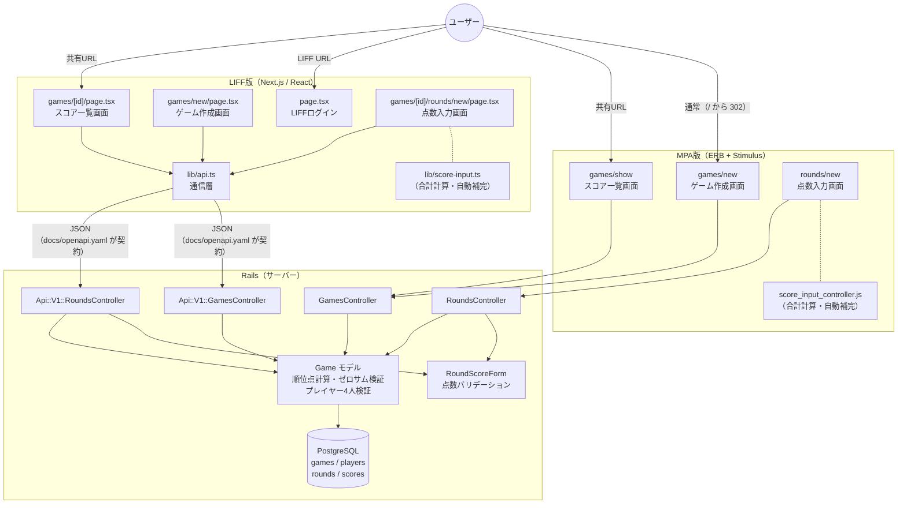
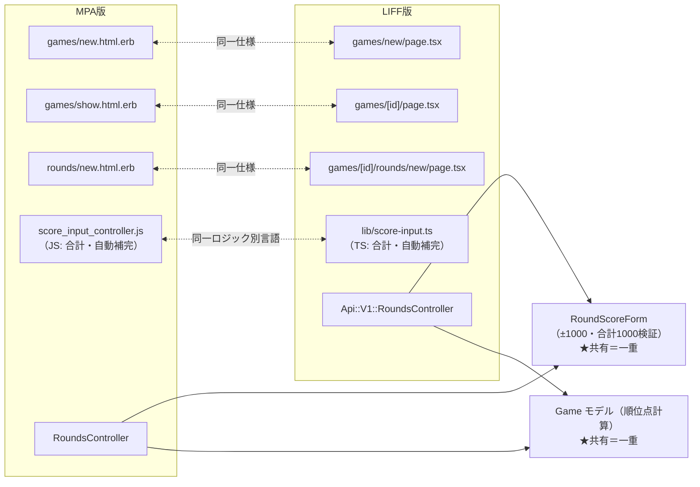

# アーキテクチャ構成図

本プロジェクトの全体像（MPA 版 + JSON API + LIFF 版の併存構成）を1枚で掴むためのドキュメント。
構成に影響する実装変更（画面・コントローラー・API の追加や削除）をしたときは、この図も更新する。

## クライアント構成の方針

- **MPA 版（ブラウザ）と LIFF 版（LINE）は、どちらも正式なクライアント**とする（マルチクライアント構成）
- MPA 版は LIFF 版へ移行するための足場ではない。撤去予定はない
- 両版の橋渡しは、JSON API（`/api/v1`）と OpenAPI 仕様書（`docs/openapi.yaml`）を契約として行う
- SPA・ネイティブアプリは当面スコープ外（CLAUDE.md の方針）
- MPA 版を残すと決めた経緯は [ADR-0001: MPA 版を残す](adr/0001-mpa-%E7%89%88%E3%82%92%E6%AE%8B%E3%81%99.md) を参照

## 全体構成図

## 二重実装マップ

MPA 版と LIFF 版で「同一仕様の別実装」になっているペアの一覧。
仕様変更時は必ずペアの両方を修正する。

- 点線ペア（m1〜m4）が「変更時に2箇所直す場所」。**実線の先（RoundScoreForm / Game モデル）は共有されており、二重実装ではない**

## 読みどころ

1. **利用者の入口は各版2つ** — 通常の入口（MPA は `/`、LIFF は LIFF URL）と、共有 URL でスコア一覧へ直接着地する経路。共有 URL は設計上の入口であり、内部リンクではない
2. **すべての矢印が Game モデルに集まる** — 順位点計算・ゼロサム検証は1箇所。壊れると全経路が壊れるため `spec/models/game_spec.rb` が最重要
3. **画面は二重、計算とデータは一重** — 点線ペアは恒久的な管理対象（[ADR-0001](adr/0001-mpa-%E7%89%88%E3%82%92%E6%AE%8B%E3%81%99.md)）。両版が同一挙動かを検証する手段は未整備（[#175](https://github.com/tsukamotohiroaki/mahjong_score/issues/175)）
4. **`lib/api.ts` と API コントローラーの間が契約境界** — ここを変えると LIFF 版だけが静かに壊れる。`docs/openapi.yaml` と `spec/requests/api/v1/` で守る。通信経路は `docs/api-proxy.md` を参照

箱とテストの対応は [`docs/test-strategy.md`](test-strategy.md) の「確認手段の分担」を参照。
