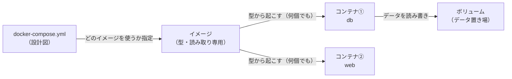
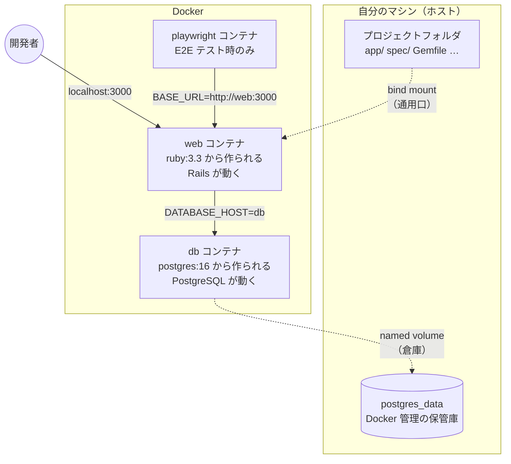
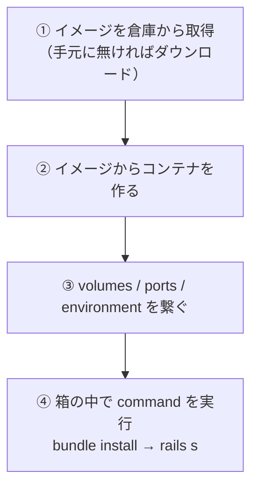

# Docker Compose の仕組み

本プロジェクトの開発環境がどう組み立てられているかを、`docker-compose.yml` の実物に沿って理解するためのドキュメント。
Docker を「手順として使えるが、中で何が起きているかは曖昧」という状態から抜けることを目的とする。

## 結論（4つの登場人物）

家づくりに例えると、それぞれの役割はこうなる。

| 用語 | 例えると | 実体 |
|---|---|---|
| `docker-compose.yml` | **設計図** | どの家を何軒建て、どう繋ぐかを書いた1枚のファイル |
| **イメージ（Image）** | **プレハブの完成品（型）** | 必要なソフトが導入済みの OS まるごと。読み取り専用で変化しない |
| **コンテナ（Container）** | **建った家** | イメージから作られた、実際に動く環境。使い捨て |
| **ボリューム（Volume）** | **倉庫 / 通用口** | コンテナの外にあるデータ置き場。2種類ある（後述） |

イメージを「材料」と捉えると誤解しやすい。材料は組み立て作業が必要だが、イメージは**すでに完成している型**で、そこから家が一瞬で建つ。1つの型から何軒建ててもイメージ自体は変化しない。

Ruby で言えば、**イメージ = クラス定義、コンテナ = インスタンス**の関係にあたる。



## db と web を並べて見る

同じ「イメージ → コンテナ → その下のデータ置き場」という流れだが、**一番下の出どころが違う**。ここが理解の要になる。

```
          【db の箱】                        【web の箱】

          Docker Hub                        Docker Hub
              │                                 │
      postgres:16 (Image)                ruby:3.3 (Image)
              │                                 │
              ▼                                 ▼
     ┌────────────────┐               ┌────────────────┐
     │   Container    │◀──────────────│   Container    │
     │  PostgreSQL    │   DB 接続      │  Rails         │
     └────────────────┘               └────────────────┘
              │                                 │
              │ 保存する                        │ 見るだけ
              ▼                                 ▼
     ┌────────────────┐               ┌────────────────┐
     │ postgres_data  │               │ プロジェクト     │
     │ games / players│               │ フォルダ        │
     │ rounds / scores│               │ app/ spec/ ...  │
     └────────────────┘               └────────────────┘
      ↑ Docker が作った倉庫             ↑ 元からある自分のフォルダ
        中身は PostgreSQL が書く          中身は自分が VSCode で書く
        = named volume                   = bind mount
```

- **db 側**は「保存先」。コンテナが書き込んだデータを貯めるために、Docker が新しく倉庫を作る
- **web 側**は「参照先」。すでに存在する自分のフォルダを、箱の中から見せているだけ

この違いが `volumes:` の2種類（後述）に対応する。

## このプロジェクトの構成

`docker-compose.yml` には箱が3つ定義されている。普段使うのは `db` と `web` の2つ。



### `docker-compose.yml` の読み方

```yaml
services:            # ここから下が「箱」の定義
  db:                # 箱①の名前。この名前が他の箱からホスト名として使える
    image: postgres:16                              # どのイメージから作るか
    environment:                                    # 箱の中に渡す環境変数
      POSTGRES_USER: postgres
    volumes:
      - postgres_data:/var/lib/postgresql/data      # ← named volume（倉庫）
    ports:
      - "5432:5432"                                 # 「ホスト側:箱の中」でポートを繋ぐ

  web:               # 箱②
    image: ruby:3.3
    depends_on:
      - db                                          # db が起動してから起動する
    working_dir: /app                               # 箱の中での作業ディレクトリ
    volumes:
      - .:/app                                      # ← bind mount（通用口）
    ports:
      - "3000:3000"
    environment:
      DATABASE_HOST: ${DATABASE_HOST:-db}           # ${変数:-既定値} で上書き可能にする
    command: bash -lc "bundle install && bin/rails s -b 0.0.0.0"   # 起動時に実行する処理

  playwright:        # 箱③
    profiles:
      - e2e                                         # profiles 付きは通常の up では起動しない

volumes:
  postgres_data:     # named volume の宣言。ここに書いて初めて使える
```

押さえておきたい点。

- **`db` という箱の名前が、そのままホスト名になる。** `web` の環境変数が `DATABASE_HOST: db` なのはこのため。同じ compose 内の箱同士は名前で通信できる
- **`ports` は「ホスト側:箱の中」の順。** `"3000:3000"` はホストの 3000 番を箱の 3000 番に繋ぐ意味
- **`command` は箱の中で実行される。** web の箱は起動のたびに `bundle install` を走らせてから Rails を起動する
- **`profiles: [e2e]` が付いた箱は `docker compose up` で起動しない。** E2E を回すときだけ明示的に指定する

## ボリュームには2種類ある

`volumes:` という同じキーワードで書かれるが、**仕組みも目的もまったく違う2つ**が存在する。ここが最も混同しやすい。

| | ① named volume（倉庫） | ② bind mount（通用口） |
|---|---|---|
| 本プロジェクトでの記述 | `postgres_data:/var/lib/postgresql/data` | `.:/app` |
| **見分け方（左側）** | **ただの名前** | **パス（`.` や `/` で始まる）** |
| 実体の場所 | `/var/lib/docker/volumes/…`（Docker が決める） | 自分で指定したフォルダそのもの |
| 中身を作るのは | コンテナ（PostgreSQL） | 開発者（エディタで編集） |
| 目的 | **消えたら困るデータの永続化** | **編集内容の即時反映** |
| ホストから直接編集 | しない | する（VSCode で日常的に） |

### ① named volume ＝ 倉庫

家の隣に建てた別棟の倉庫。**家（コンテナ）を取り壊しても倉庫は残る。**

ゲーム・プレイヤー・点数などのデータはここに入っている。`docker compose down` でコンテナを消してもデータが消えないのはこのため。

実体の場所は Docker が管理しており、次のコマンドで確認できる。

```bash
docker volume ls
docker volume inspect mahjong_score_postgres_data --format "{{.Mountpoint}}"
# → /var/lib/docker/volumes/mahjong_score_postgres_data/_data
```

### ② bind mount ＝ 通用口

家の壁に付けた通用口で、自分のマシンのフォルダに直結している。**保管しているのではなく、外にある実体を箱の中から見せているだけ。**

`.:/app` は「プロジェクトフォルダを、箱の中では `/app` という名前で見せる」という意味。

この仕組みがあるおかげで、次の2つが成り立つ。

- **コードを編集してもイメージを作り直さなくてよい。** ファイルを保存した瞬間、箱の中からもその内容が見える
- **コンテナを壊しても作業内容は消えない。** ソースコードの実体はホスト側にあるため

**ソースコードはイメージの中には入っていない。** これは実際に確かめられる。

```bash
# bind mount なし → /app は存在しない
docker run --rm ruby:3.3 ls /app
# → ls: cannot access '/app': No such file or directory

# bind mount あり → プロジェクトのファイルが見える
docker run --rm -v "$(pwd)":/app ruby:3.3 ls /app
# → CLAUDE.md  Gemfile  app  spec  …
```

同じイメージなのに結果が変わる。つまり `/app` の中身はイメージ由来ではなく、bind mount が外から見せているものだと分かる。

なお、コマンドラインの `-v` と compose の `volumes:` は**同じ設定**で、書く場所が違うだけ。

## `docker compose up` が実際にやること



**①で失敗すると②以降に到達しない。** ネットワーク制限などでイメージを取得できない環境では、ここで止まる。

## イメージ名の読み方

イメージ名は3つのパーツでできている。

```
mirror.gcr.io / library/ruby : 3.3.10
──────┬─────   ──────┬─────   ───┬──
   どの倉庫から      何を      どの版
```

**倉庫の部分は省略でき、省略すると Docker Hub になる。**

```yaml
image: ruby:3.3
# ↑ 下の省略形
image: docker.io/library/ruby:3.3
```

### タグの固定について

`ruby:3.3` は「3.3 系の最新パッチ版」を指す**浮動タグ**で、中身が予告なく変わる。Gemfile は `ruby "3.3.10"` とパッチバージョンまで指定しているため、イメージ側が 3.3.11 に変わると bundler が不一致で停止し、コンテナが起動しなくなる。

```
Your Ruby version is 3.3.11, but your Gemfile specified 3.3.10
```

Ruby のバージョン指定は4箇所にあり、**すべて一致している必要がある**。

| 場所 | 指定 |
|---|---|
| `.ruby-version` | `ruby-3.3.10` |
| `Gemfile` | `ruby "3.3.10"` |
| `.github/workflows/ci.yml`（2箇所） | `ruby-version: "3.3.10"` |
| `docker-compose.yml` | ← ここも固定する必要がある |

## よく使う操作

| コマンド | 何をするか |
|---|---|
| `docker compose up` | 設計図どおりに箱を起動する（ログが流れる） |
| `docker compose up -d` | 同上。バックグラウンドで起動 |
| `docker compose ps` | 起動中の箱の一覧 |
| `docker compose logs web` | web の箱のログを見る |
| `docker compose exec web bash` | **起動中の**箱の中に入る |
| `docker compose run --rm web <cmd>` | **使い捨ての**箱でコマンドを1回実行する |
| `docker compose down` | 箱を停止・削除する（**倉庫は残る＝データは無事**） |

`exec` と `run` の違いは重要。`exec` は既に動いている箱に入るので、事前に `up` しておく必要がある。`run` はその場で新しい箱を作るため、`up` していなくても使える。

### ⚠️ 取り返しのつかない操作

```bash
docker compose down -v
```

`-v` を付けると **named volume（倉庫）も削除される。開発用データベースの中身が完全に消え、復旧できない。**

「なんとなく `-v` を付ける」は避ける。データを意図的に初期化したいときだけ使う。

## 関連ドキュメント

- `docs/architecture.md` — アプリ全体の構成（MPA 版 + JSON API + LIFF 版）
- `docs/api-proxy.md` — フロントエンドと Rails の通信経路
