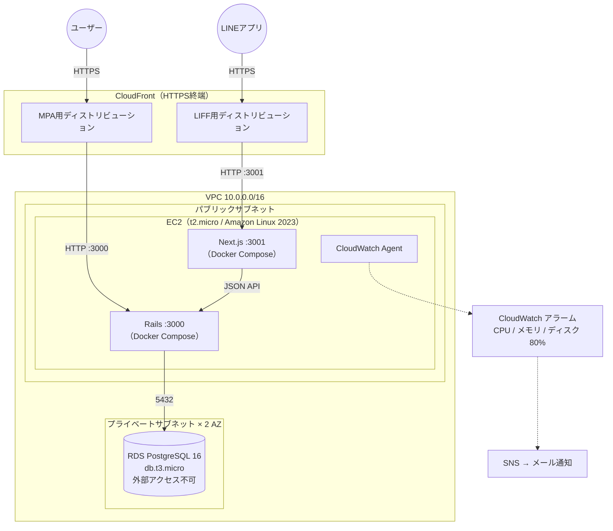

# インフラ構成

本番環境（AWS）の構成と、その設計判断・受け入れたリスクを言語化するドキュメント。
実体は `infra/cloudformation.yml`（CloudFormation テンプレート）にあり、このドキュメントは「なぜそうしたか」を説明する。
構成に影響する変更（リソースの追加・削除・セキュリティ設定の変更）をしたときは、このドキュメントも更新する。

## 全体構成図

## 設計判断と理由

### なぜ EC2 + Docker Compose か（ECS や PaaS ではなく）

- MVP フェーズの最優先は「最短でリリースして動かすこと」。開発環境の Docker Compose 構成をそのまま本番に持ち込める構成が最速だった
- 開発と本番が同じ `docker-compose.yml` をベースにするため、**環境差分による「本番でだけ壊れる」リスクを小さくできる**（本番差分は `docker-compose.production.yml` に分離）
- コスト最小（t2.micro / db.t3.micro）で運用できる
- ECS・Kubernetes への移行はユーザー数が増えてから再評価する

### なぜデータベースだけマネージド（RDS）か

- このアプリの資産は**スコアデータそのもの**。テスト戦略（`docs/test-strategy.md`）で守っている「スコアの正しさ」も、データが消えれば意味がない
- アプリサーバーは壊れても作り直せる（CloudFormation + UserData で再構築可能）が、**データの損失だけは取り返しがつかない**
- そのため、データベースだけは自前運用せず RDS に任せ、自動バックアップ7日分・スロークエリログ・エラーログ出力を有効にしている

### なぜ CloudFormation（Infrastructure as Code）か

- 手作業のコンソール操作は「何をどう作ったか」が残らず、再現もレビューもできない
- テンプレート化することで、環境の再構築が1コマンドででき、構成変更が Git の差分としてレビューできる
- シークレット（データベースパスワード・`RAILS_MASTER_KEY`）は `NoEcho` パラメータで渡し、テンプレートに残さない

### なぜ CloudFront で HTTPS 化か（ロードバランサーや ACM 証明書ではなく）

- LIFF（LINE Front-end Framework）と `navigator.share` が HTTPS を必須とするため、HTTPS 化は機能要件
- CloudFront のデフォルトドメインを使えば証明書の取得・更新が不要で、独自ドメイン費用もかからない
- Application Load Balancer（ALB）より低コストで、日本のエッジを含む最安プライスクラス（PriceClass_200）を指定

## ネットワークとセキュリティの設計

**多層防御の考え方**: 一番守るべきデータ（RDS）ほど深い場所に置く。

| 層 | 設定 | 意図 |
|---|---|---|
| RDS | プライベートサブネット配置・`PubliclyAccessible: false` | インターネットから直接到達できない |
| RDS のセキュリティグループ | EC2 のセキュリティグループからの 5432 のみ許可 | IP ではなくセキュリティグループ参照で許可するため、EC2 の IP が変わっても壊れない |
| EC2 | パブリックサブネット。22（SSH）/ 3000 / 3001 のみ開放 | 公開するポートを明示的に限定 |
| CloudFront | `redirect-to-https` | 平文 HTTP のアクセスを HTTPS へ強制 |

### キャッシュ事故の防止（QA 視点の設計）

CloudFront のキャッシュ方針は「**古いスコアが表示される事故**」を最重要リスクとして設計している。

- 動的コンテンツ（HTML・`/api/*`）: キャッシュ無効（Managed-CachingDisabled）。スコアは常に最新を返す
- 静的アセット（`/assets/*`・`/_next/static/*`）: キャッシュ許可（Managed-CachingOptimized）。ファイル名にダイジェスト／ハッシュが付き**内容が変わればURLも変わる＝不変**なので、キャッシュしても事故が起きない

「キャッシュして良いのは不変なものだけ」という原則で、性能と正しさを両立させている。

## 監視と異常検知

「気づける仕組み」を最小構成で用意している。

- **CloudWatch アラーム**: CPU・メモリ・ディスクの使用率 80% 超過で SNS 経由のメール通知（復旧時も通知）
- **CloudWatch Agent**: 標準メトリクスにないメモリ・ディスク使用率を収集
- **RDS ログ**: 1秒以上のスロークエリ・接続/切断・エラーを CloudWatch Logs へ出力
- **セットアップログ**: EC2 初期構築（UserData）のログを `/var/log/user-data.log` に残し、構築失敗時に原因を追える

## 可用性と復旧の考え方

- **EC2 は使い捨て可能に**: 構築手順はすべて UserData にコード化されており、インスタンスが壊れてもスタック再作成で復元できる
- **再起動への耐性**: systemd サービス（`infra/mahjong-score.service`）で EC2 再起動時にアプリが自動起動する
- **データの復旧**: RDS の自動バックアップ（7日保持）でポイントインタイムリカバリが可能

## 受け入れているリスク（意図的な割り切り）

リスクは「起きる可能性 × 影響の大きさ × 受け入れ可否」で判断し、以下は**現フェーズでは受け入れる**と決めている。

| リスク | 影響 | 受け入れる理由 / 将来の対応 |
|---|---|---|
| EC2 が単一インスタンス（単一障害点） | アプリ停止 | ユーザーは少人数で、止まっても失うのは「入力できない時間」だけ。データは RDS に分離済みで失われない。スケール時に ALB + 複数台化を検討 |
| RDS がシングル AZ | データベース停止（データは残る） | マルチ AZ は費用倍増。バックアップ7日で復旧可能なため MVP では見送り |
| SSH ポートが全開放（0.0.0.0/0） | 不正アクセス試行を受ける | 認証は鍵ペアのみで辞書攻撃は成立しない。改善候補: 自宅 IP 制限または AWS Systems Manager Session Manager への移行 |
| デプロイが手動（SSH + `git pull`） | 手順ミス・属人化 | リリース頻度が低い間は手順書（README）でカバー。GitHub Actions からの自動デプロイ化が改善候補 |
| RDS の削除保護が無効 | 誤操作でのデータベース削除 | 学習用に作り直す頻度が高いため無効化中。**本運用に入る前に必ず有効化する** |

## 費用の目安

- EC2 t2.micro + RDS db.t3.micro + gp3 20GB + CloudFront（低トラフィック）で、個人開発として維持できる最小構成
- インスタンスタイプは CloudFormation のパラメータ化済みで、スケールアップはパラメータ変更のみで可能

## 関連ドキュメント

- `infra/cloudformation.yml` — 本ドキュメントの実体（コメント付きテンプレート）
- `docs/architecture.md` — アプリケーション側の構成図（MPA / LIFF / API）
- `docs/test-strategy.md` — テスト戦略（何を守るかの考え方はこのドキュメントと共通）
- `README.md` — デプロイ手順・トラブルシューティング
