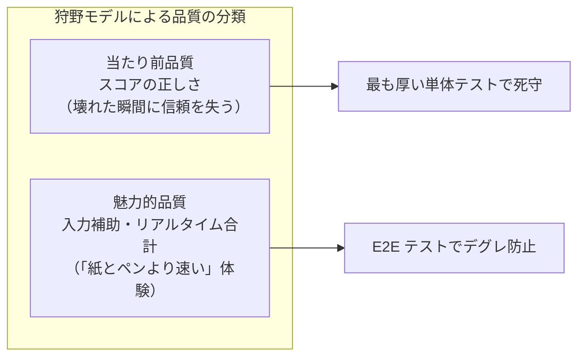

# テスト戦略

「どこに厚くテストを張り、どこを浅くし、なぜそう判断したか」を1枚で掴むためのドキュメント。テスト構成に影響する変更をしたときは、このドキュメントも更新する。

## 品質保証の考え方

守る対象は機能ではなく体験。このアプリの体験の核は **「記録したスコアが正しい」** こと。

- **リスクベースドテスト**: リスクを「起きる可能性 × 影響の大きさ × 受け入れ可否」で評価し、高い箇所に厚く配分する
- **欠陥を検出する仕組み（RSpec・Vitest・Playwright・実機）と、作り込まない仕組み（TDD・依存マップ・トランザクション）の両輪**。「気をつける」ではなく「気をつけなくても壊れない仕組み」を優先する
- テスト技法（同値分割・境界値分析など）と実例の対応は [README の「テスト設計」](../README.md#テスト設計テスト技法との対応) を参照

## 急所マップ

「ここが壊れたらアプリの価値がなくなる」箇所と、その守り方。

| 急所 | なぜ急所か | 守り方 |
|---|---|---|
| ① 順位点計算 `Game#calculate_ranking_scores` | 計算バグは例外を出さず、**黙って間違った数字を出す**。テストでしか守れない | `game_spec`（同点分配・境界値を網羅） |
| ② データ不変条件 ゼロサム検証・プレイヤー4人固定 | 不正データは入った瞬間に**以後の全計算を汚染する**。入口で止めるのが最も安い | `game_spec`（3/5/0人・配列以外）＋トランザクション |
| ③ 点数入力フロー ±10万点・合計10万点ちょうど | ユーザーが毎回通る導線で、**不正値の唯一の入口** | リクエストスペック＋ E2E ＋ Vitest |

急所③のクライアント側検証は UX のため。**正はサーバー側の検証**（`RoundScoreForm` に一本化。MPA・LIFF どちらの経路も同じ検証を通る）で、すり抜けた値も必ず拒否する。

## 確認手段の分担

守る範囲が重ならないように、手段ごとの担当を固定する。**同じことを2つの手段で確認しない**（重複すると続かないうえに実施漏れも分からなくなる）。

| 手段 | 守る範囲 | MPA 版 | LIFF 版 |
|---|---|---|---|
| **RSpec モデルスペック** | 計算・不変条件（急所①②） | ○ | ○（計算はサーバー側に一本化されているため両版で共有） |
| **RSpec リクエストスペック** | HTTP 入出力・バリデーション | ○ | ○（JSON API） |
| **Vitest**（`frontend/app/**/*.test.*`） | React コンポーネント・`lib/api.ts`・`lib/score-input.ts` | – | ○ |
| **Playwright** | 本物のブラウザでの機能挙動 | `e2e/` | `e2e-liff/` |
| **Claude in Chrome** | 操作してから画面が表示されるまでの応答速度 | ○ | – |
| **実機（人間 + スマホ）** | LINE アプリの中でしか起こらないこと | – | ○ |

境界の引き方:

- **Vitest と Playwright**: Vitest は jsdom 上で API もモックするため、実際の HTTP 通信は一度も発生しない。「関数は呼ばれたが通信は届いていない」を検出できるのは Playwright だけ
- **Playwright と Claude in Chrome**: Playwright は動くかどうかしか見ない。3倍遅くなっても通過する。時間を実測するのが Claude in Chrome
- **Claude in Chrome と実機**: デスクトップの Chrome では LINE アプリ内の WebView に到達できない。共有シート・テンキー・LIFF の起動導線は実機のみ

確認項目の一覧: Playwright は [#175 のコメント](https://github.com/tsukamotohiroaki/mahjong_score/issues/175#issuecomment-5381018205)、Claude in Chrome は [`.claude/skills/response-time/SKILL.md`](../.claude/skills/response-time/SKILL.md)（`/response-time` は開発環境、`/response-time production` は本番環境）、実機は [`docs/manual-test-checklist.md`](manual-test-checklist.md)。

### 二重実装への備え

MPA 版と LIFF 版は同一仕様の別実装であり、[恒久的な管理対象](adr/0001-mpa-%E7%89%88%E3%82%92%E6%AE%8B%E3%81%99.md)である（同一仕様ペアの一覧は `docs/architecture.md`）。順位点計算は `Game` モデル1箇所にしかなく二重にならないが、**入力補助の計算（合計・自動補完）は二重実装**（`score_input_controller.js` と `lib/score-input.ts`）で、ブラウザ内で完結するためサーバー側のテストでは守れない。

片方だけを修正しても、実装ごとに分かれたテストは双方とも緑のまま通過してしまう。これを防ぐため、Playwright は**1本の spec を `baseURL` 違いの2プロジェクトで実行する**方針とする（現状は別 spec。統合は [#175](https://github.com/tsukamotohiroaki/mahjong_score/issues/175) で整備予定）。テストが1本しかないからこそ、実装の食い違いが必ず表面化する。

## テストの厚み配分

急所には厚く、単純な箇所は浅く。偏りは意図的なもの。具体的なテストケースは `spec/`・`e2e/`・`frontend/` のテスト名が唯一の情報源。

MPA 版・サーバー側:

| 対象 | テスト | 厚み |
|---|---|---|
| 急所①② 計算・不変条件 | `spec/models/game_spec.rb` | ◎ 最厚（同点分配・境界値を個別に網羅） |
| 急所③ 点数入力（MPA / API） | `spec/requests/**/rounds_spec.rb` | ◎ 厚い（バリデーション・上書き・採番） |
| 急所③ の JS 挙動 | `e2e/score_input.spec.ts` | ○ E2E の大半をここに集中 |
| ゲーム作成・一覧（MPA / API） | `spec/requests/**/games_spec.rb` | ○ 入出力を網羅 |
| 周辺モデル（Player / Round / Score） | 各モデルスペック | △ 浅い（単純なバリデーションのみ） |
| トップページ | `e2e/home.spec.ts` | △ スモークのみ |

LIFF 版:

| 対象 | テスト | 厚み |
|---|---|---|
| 急所③ の JS 挙動 | `frontend/app/games/[id]/rounds/new/page.test.tsx` | ◎ 厚い（合計・自動補完・送信可否・上書き・APIエラー） |
| ゲーム作成 | `frontend/app/games/new/page.test.tsx` | ○ 入出力＋二重送信の防止 |
| スコア一覧 | `frontend/app/games/[id]/page.test.tsx` | ○ 表示＋共有ボタンの分岐を網羅 |
| API 通信層 | `frontend/app/lib/api.test.ts` | ○ リクエスト形式・エラー変換 |
| LIFF ログイン | `frontend/app/page.test.tsx` | △ SDK をモックして分岐のみ（E2E 対象外） |

## テスト以外の堅牢化の工夫

- **トランザクション**: ゲーム＋プレイヤー4人の作成、ラウンド＋スコア4件の保存は「全部成功 or 全部ロールバック」
- **OpenAPI 仕様書**（`docs/openapi.yaml`）: MPA 版と LIFF 版をつなぐ JSON API の契約を明文化
- **依存マップ**（`.claude/dependencies.md`）: コード変更前に影響を受けるテストを把握する
- **TDD（テスト駆動開発）**: テストを先に書き、Red → Green → Refactor
