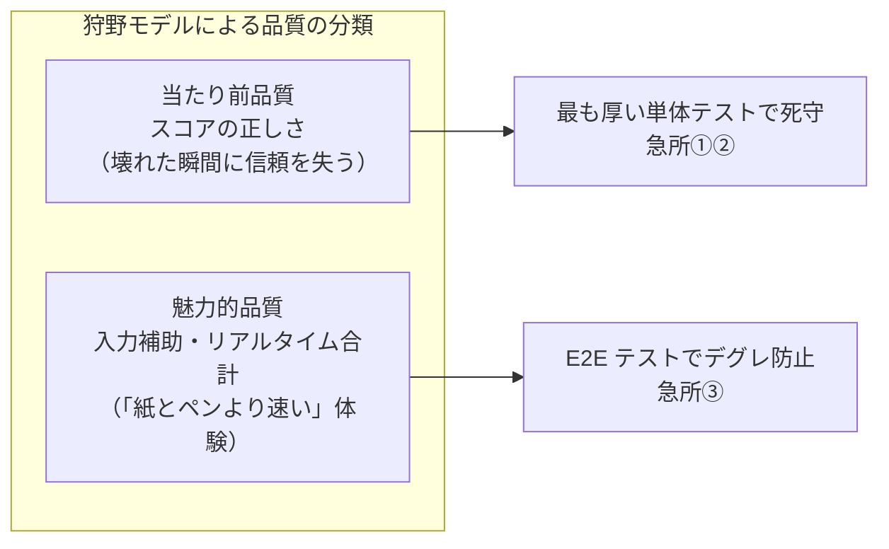
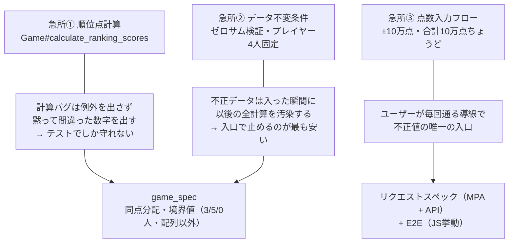

# テスト戦略

品質保証の全体像を1枚で掴むためのドキュメント。「どこに厚くテストを張り、どこを浅くし、なぜそう判断したか」を言語化する。
テスト構成に影響する変更をしたときは、このドキュメントも更新する。

## 品質保証の考え方

守る対象は機能ではなく体験。このアプリの体験の核は **「記録したスコアが正しい」** こと。

- **リスクベースドテスト**: リスクを「起きる可能性 × 影響の大きさ × 受け入れ可否」で評価し、高い箇所に厚く配分する
- **品質コントロール（QC）** = 欠陥を**検出する**活動（RSpec・Playwright・探索的テスト）
- **品質保証（QA）** = 欠陥を**作り込まない**プロセス（TDD・依存マップ・二重実装マップ）。「気をつける」ではなく「気をつけなくても壊れない仕組み」はこちら側の思想

## 急所マップ

「ここが壊れたらアプリの価値がなくなる」箇所と、その守り方。

補足:

- 急所②はトランザクションで「全部成功 or 全部ロールバック」の二択にする
- 急所③のクライアント側検証（Stimulus）は UX のため。**正はサーバー側の検証**で、すり抜けた値も必ず拒否する（二重防御）

## テストの厚み配分

急所には厚く、単純な箇所は浅く。厚みの偏りは意図的なもの。
具体的なテストケースは `spec/` と `e2e/` が唯一の情報源（テスト名がそのまま仕様を語る）。

### レイヤーごとの役割

| レイヤー | ツール | 守るもの | 例え |
|---|---|---|---|
| E2E（End-to-End） | Playwright | JS挙動・ユーザー操作フロー | お客さんの席を守る門番 |
| リクエストスペック | RSpec | HTTP入出力・バリデーション | 注文の受け渡しを守る門番 |
| モデルスペック | RSpec | 計算ロジック・不変条件 | 厨房の裏側を守る門番 |

### 対象ごとの配分

| 対象 | テスト | 厚み |
|---|---|---|
| 急所①② 計算・不変条件 | `spec/models/game_spec.rb` | ◎ 最厚（同点分配・境界値を個別に網羅） |
| 急所③ 点数入力（MPA / API） | `spec/requests/**/rounds_spec.rb` | ◎ 厚い（バリデーション・上書き・採番） |
| 急所③ の JS 挙動 | `e2e/score_input.spec.ts` | ○ E2E の大半をここに集中 |
| ゲーム作成・一覧（MPA / API） | `spec/requests/**/games_spec.rb` | ○ 入出力を網羅 |
| 周辺モデル（Player / Round / Score） | 各モデルスペック | △ 浅い（単純なバリデーションのみ） |
| トップページ | `e2e/home.spec.ts` | △ スモークのみ |

### E2E を薄く保つ理由

- 遅く、フレイキー（不安定）になりやすい。増やすほど CI の速度と信頼性が落ちる
- バリデーションの組み合わせはリクエストスペックで担保済み。E2E には**ブラウザでしか検証できないもの**だけを置く
- 導入タイミングも戦略のうち: インライン JavaScript → Stimulus リファクタリングの前に、現在の動作を E2E で固定してから書き換える（安全網）

## テスト以外の堅牢化の工夫

- **トランザクション**: ゲーム＋プレイヤー4人の作成、ラウンド＋スコア4件の保存は「全部成功 or 全部ロールバック」
- **二重実装マップ**（`docs/architecture.md`）: MPA 版と LIFF 版の同一仕様ペアを一覧化し、片方だけ直して仕様が乖離する事故を防ぐ
- **OpenAPI 仕様書**（`docs/openapi.yaml`）: MPA 版と LIFF 版をつなぐ JSON API の契約を明文化
- **依存マップ**（`.claude/dependencies.md`）: コード変更前に影響を受けるテストを把握する（TDAD: Test-Driven Agentic Development）
- **TDD（テスト駆動開発）**: テストを先に書き、Red → Green → Refactor

## やらないと決めたこと

限られたリソースをリスクの高い箇所に集中させるための、意図的な割り切り。

- **E2E での網羅的バリデーション検証**: リクエストスペックと重複し、コストだけ増える
- **カバレッジ100%の追求**: カバレッジは結果指標であり目的ではない。急所の網羅を優先する
- **周辺モデルへの深いテスト**: 単純なバリデーションのみのモデルは浅いテストで十分
- **負荷・セキュリティ・ビジュアルリグレッションテスト**: ユーザー数・データ量が小さい MVP フェーズでは低リスク。本格運用フェーズで再評価する

## テストの7原則との対応

JSTQB（Japan Software Testing Qualifications Board）が定義するテストの7原則のうち、この戦略に直結しているもの。

| 原則 | このプロジェクトでの実践 |
|---|---|
| 全数テストは不可能 | だからリスクベースで厚みを配分する。周辺は浅くてよい |
| 欠陥の偏在 | 欠陥は急所（計算・入力・不変条件）に集中すると予測し、急所マップを作った |
| 早期テストで時間とコストを節約 | TDD でテストを先に書く（シフトレフト）。実装後に見つけるより手戻りが小さい |
| 殺虫剤のパラドックス | 同じ自動テストの繰り返しでは新しい欠陥は見つからない。探索的テスト（Claude in Chrome）を併用する |
| 「バグゼロ」の落とし穴 | テストが全部通ることと価値があることは別。E2E はユーザー操作フローの単位で書く |
