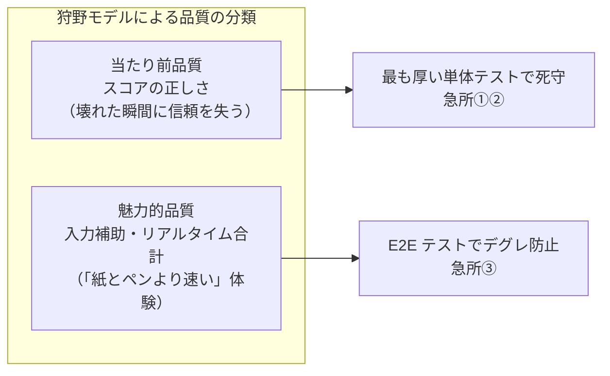
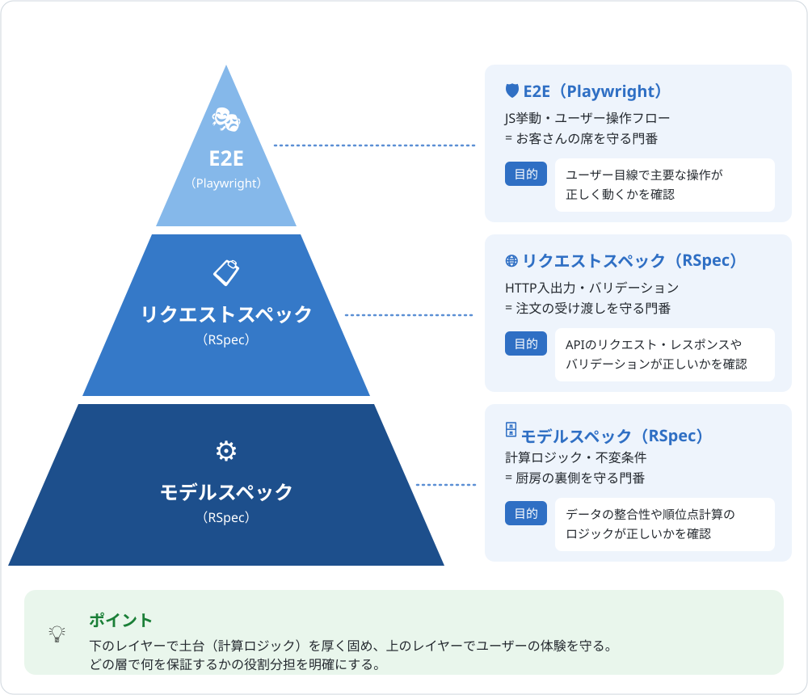

# テスト戦略

品質保証の全体像を1枚で掴むためのドキュメント。「どこに厚くテストを張り、どこを浅くし、なぜそう判断したか」を言語化する。
テスト構成に影響する変更をしたときは、このドキュメントも更新する。

## 品質保証の考え方

守る対象は機能ではなく体験。このアプリの体験の核は **「記録したスコアが正しい」** こと。

- **リスクベースドテスト**: リスクを「起きる可能性 × 影響の大きさ × 受け入れ可否」で評価し、高い箇所に厚く配分する
- **品質コントロール（QC）** = 欠陥を**検出する**活動（RSpec・Vitest・Playwright・探索的テスト・実機確認）
- **品質保証（QA）** = 欠陥を**作り込まない**プロセス（TDD・依存マップ・二重実装マップ）。「気をつける」ではなく「気をつけなくても壊れない仕組み」はこちら側の思想

## テスト技法との対応

テストケースの設計に使っている技法（同値分割・境界値分析・デシジョンテーブルなど）と本アプリの実例の対応表は [README の「テスト設計」セクション](../README.md#テスト設計テスト技法との対応) にまとめている。

## 確認手段の分担

守る範囲が重ならないように、手段ごとの担当を固定する。**同じことを2つの手段で確認しない**（手動確認が自動テストと重複すると、続かないうえに実施漏れも分からなくなる）。

| 手段 | 守る範囲 |
|---|---|
| **RSpec**（`spec/`） | サーバー側の計算・バリデーション・レスポンス |
| **Vitest**（`frontend/app/**/*.test.*`） | LIFF 版の React コンポーネント・`lib/api.ts`・`lib/score-input.ts` |
| **Playwright**（`e2e/` `e2e-liff/`） | 本物のブラウザでの機能挙動。現状は MPA 版と LIFF 版で別 spec。1本の spec を両方に流す形への統合は [#175](https://github.com/tsukamotohiroaki/mahjong_score/issues/175) で整備予定 |
| **Claude in Chrome** | 操作してから画面が表示されるまでの応答速度 |
| **実機（人間 + スマホ）** | LINE アプリの中でしか起こらないこと |

### 境界の引き方

- **Vitest と Playwright**: Vitest は jsdom 上で動き API もモックするため、**実際の HTTP 通信は一度も発生しない**。「関数は正しく呼ばれたが通信は届いていない」を検出できるのは Playwright だけ
- **Playwright と Claude in Chrome**: Playwright は**動くかどうかしか見ない**。同じ操作が3倍遅くなっても、アサーションが無ければ通過する。押してから画面が出るまでの時間を実測するのが Claude in Chrome
- **Claude in Chrome と実機**: Claude in Chrome はデスクトップの Chrome を操作するため、LINE アプリ内の WebView には到達できない。共有シート・テンキー・LIFF の起動導線は実機でしか確認できない

各手段の具体的な確認項目は次を参照する。

| 手段 | 一覧 |
|---|---|
| Playwright | [#175 のコメント](https://github.com/tsukamotohiroaki/mahjong_score/issues/175#issuecomment-5381018205) |
| Claude in Chrome | [`.claude/skills/response-time/SKILL.md`](../.claude/skills/response-time/SKILL.md)（`/response-time` は開発環境、`/response-time production` は本番環境） |
| 実機（人間 + スマホ） | [`docs/manual-test-checklist.md`](manual-test-checklist.md) |

### 二重実装が前提にあること

MPA 版と LIFF 版は同一仕様の別実装であり、これは[恒久的な管理対象](adr/0001-mpa-%E7%89%88%E3%82%92%E6%AE%8B%E3%81%99.md)である。**片方だけを修正しても、実装ごとに分かれたテスト（MPA は `e2e/`、LIFF は `e2e-liff/` と Vitest）は双方とも緑のまま通過してしまう。**

これを防ぐため、Playwright は同じ内容のテストを2本書くのではなく、**1本の spec を `baseURL` 違いの2プロジェクトで実行する**方針とする（現状は別 spec。統合は [#175](https://github.com/tsukamotohiroaki/mahjong_score/issues/175) で整備予定）。テストが1本しかないからこそ、実装の食い違いが必ず表面化する。

## 急所マップ

「ここが壊れたらアプリの価値がなくなる」箇所と、その守り方。

| 急所 | なぜ急所か | 守り方 |
|---|---|---|
| ① 順位点計算 `Game#calculate_ranking_scores` | 計算バグは例外を出さず、**黙って間違った数字を出す**。クラッシュしないため気づけず、テストでしか守れない | `game_spec`（同点分配・境界値を網羅） |
| ② データ不変条件 ゼロサム検証・プレイヤー4人固定 | 不正データは入った瞬間に**以後の全計算を汚染する**。入口で止めるのが最も安い | `game_spec`（3/5/0人・配列以外）＋トランザクションで「全部成功 or 全部ロールバック」 |
| ③ 点数入力フロー ±10万点・合計10万点ちょうど | ユーザーが毎回通る導線で、**不正値の唯一の入口** | リクエストスペック（MPA / API）＋ E2E（JS挙動）＋ Vitest（LIFF 版の入力フォーム） |

補足: 急所③のクライアント側検証は UX のため（MPA は Stimulus、LIFF は `lib/score-input.ts`）。**正はサーバー側の検証**で、すり抜けた値も必ず拒否する（二重防御）。サーバー側は `RoundScoreForm` に一本化されており、MPA・LIFF どちらの経路も同じ検証を通る。

## テストの厚み配分

急所には厚く、単純な箇所は浅く。厚みの偏りは意図的なもの。
具体的なテストケースは `spec/` と `e2e/` が唯一の情報源（テスト名がそのまま仕様を語る）。

### レイヤーごとの役割

上図は **MPA 版とサーバー側**の階層。LIFF 版は構成が異なる。

| 層 | MPA 版 | LIFF 版 |
|---|---|---|
| E2E | Playwright（`e2e/`） | Playwright（`e2e-liff/`） |
| 画面・入出力 | RSpec リクエストスペック | Vitest（コンポーネント） |
| 計算・不変条件 | RSpec モデルスペック | **同じ RSpec モデルスペックが守る**（計算はサーバー側に一本化されているため） |

最下層を両版で共有しているのがこの構成の要点。**順位点計算は `Game` モデル1箇所にしかなく**、LIFF 版は API 経由で結果を受け取るだけなので、ここが二重になることはない。

一方で**入力補助の計算（合計・自動補完）は二重実装**であり（`score_input_controller.js` と `lib/score-input.ts`）、ブラウザ内で完結するためサーバー側のテストでは守れない。この層の食い違いを検出できるのは Playwright だけである。

### 対象ごとの配分

| 対象 | テスト | 厚み |
|---|---|---|
| 急所①② 計算・不変条件 | `spec/models/game_spec.rb` | ◎ 最厚（同点分配・境界値を個別に網羅） |
| 急所③ 点数入力（MPA / API） | `spec/requests/**/rounds_spec.rb` | ◎ 厚い（バリデーション・上書き・採番） |
| 急所③ の JS 挙動 | `e2e/score_input.spec.ts` | ○ E2E の大半をここに集中 |
| ゲーム作成・一覧（MPA / API） | `spec/requests/**/games_spec.rb` | ○ 入出力を網羅 |
| 周辺モデル（Player / Round / Score） | 各モデルスペック | △ 浅い（単純なバリデーションのみ） |
| トップページ | `e2e/home.spec.ts` | △ スモークのみ |
| 急所③ の JS 挙動（LIFF 版） | `frontend/app/games/[id]/rounds/new/page.test.tsx` | ◎ 厚い（合計・自動補完・送信可否・上書き・APIエラー） |
| ゲーム作成（LIFF 版） | `frontend/app/games/new/page.test.tsx` | ○ 入出力＋二重送信の防止 |
| スコア一覧（LIFF 版） | `frontend/app/games/[id]/page.test.tsx` | ○ 表示＋共有ボタンの分岐を網羅 |
| API 通信層（LIFF 版） | `frontend/app/lib/api.test.ts` | ○ リクエスト形式・エラー変換 |
| LIFF ログイン（LIFF 版） | `frontend/app/page.test.tsx` | △ SDK をモックして分岐のみ（E2E 対象外） |

## テスト以外の堅牢化の工夫

- **トランザクション**: ゲーム＋プレイヤー4人の作成、ラウンド＋スコア4件の保存は「全部成功 or 全部ロールバック」
- **二重実装マップ**（`docs/architecture.md`）: MPA 版と LIFF 版の同一仕様ペアを一覧化し、片方だけ直して仕様が乖離する事故を防ぐ
- **OpenAPI 仕様書**（`docs/openapi.yaml`）: MPA 版と LIFF 版をつなぐ JSON API の契約を明文化
- **依存マップ**（`.claude/dependencies.md`）: コード変更前に影響を受けるテストを把握する（TDAD: Test-Driven Agentic Development）
- **TDD（テスト駆動開発）**: テストを先に書き、Red → Green → Refactor

## テストの7原則との対応

JSTQB（Japan Software Testing Qualifications Board）が定義するテストの7原則のうち、この戦略に直結しているもの。

| 原則 | このプロジェクトでの実践 |
|---|---|
| 全数テストは不可能 | だからリスクベースで厚みを配分する。周辺は浅くてよい |
| 欠陥の偏在 | 欠陥は急所（計算・入力・不変条件）に集中すると予測し、急所マップを作った |
| 早期テストで時間とコストを節約 | TDD でテストを先に書く（シフトレフト）。実装後に見つけるより手戻りが小さい |
| 殺虫剤のパラドックス | 同じ自動テストの繰り返しでは新しい欠陥は見つからない。人手による探索的テストを併用する |
| 「バグゼロ」の落とし穴 | テストが全部通ることと価値があることは別。E2E はユーザー操作フローの単位で書く |
